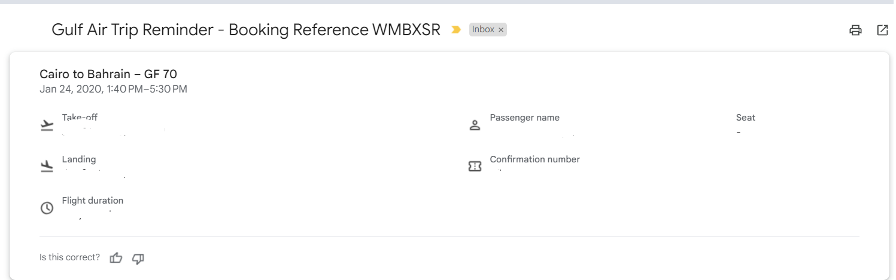

### **this service listens to message queue in queue named (message queue) :**
  * booking service will send message to notification queue 
  * notification queue will send me `booking_id` and `notification_id` 
  * i will get notification records from database using `notification_id`
   

  * then  notify customer via email or sms then using this format (usetheam leaf or  freemaker)
   
  * else i will directly record in notification table
                              

also this service send or act as a producer to message queue 

### **when it sends the message ?** 
  * it sends the message when it receives  a message  from another rmq called dead letter queue from (booking queue)
  * it will always send message saying booking failed

so we need to consume messages from dead letter queue from booking queue

